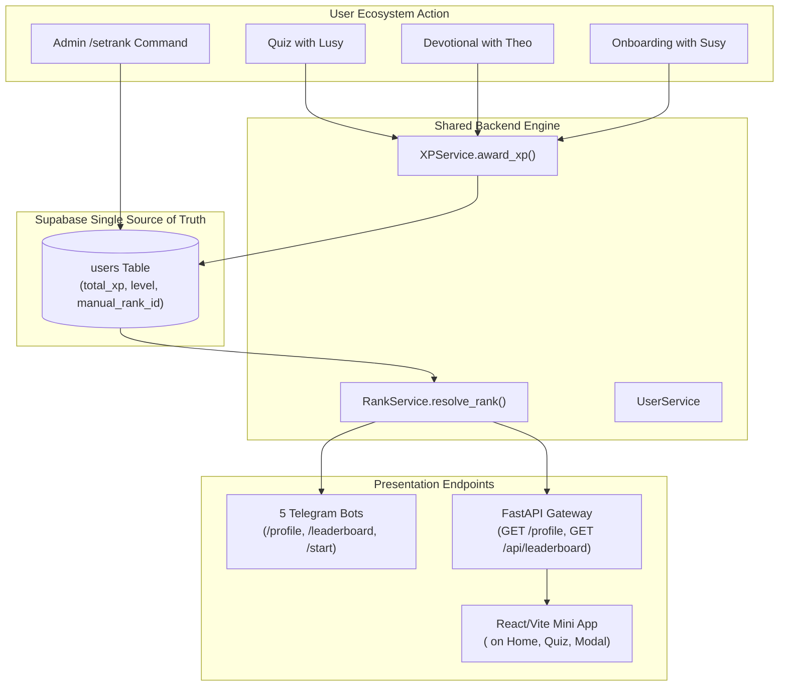

# YouThopiaOS Community Hierarchy & Ranking System

This document explains the **4-Tier, 9-Rank Community Hierarchy** in YouThopiaOS: what it is, why it was designed this way, how it works across the entire codebase, and how it connects our 5 Telegram bots with the React Mini App.

---

## 1. Overview & Community Vision

The YouThopia hierarchy translates spiritual growth, active participation, and community leadership into a clear, tangible progression ladder.

### The 4 Tiers & 9 Official Ranks

| Tier | Rank ID | Official Title | Emoji | Badge Color | Requirement / Mode | Purpose & Character |
| :--- | :--- | :--- | :---: | :---: | :--- | :--- |
| **Tier 1: Entry Level** | `seeker` | **YouTopian Seeker** | 🌸 | `#D98A95` | 0 YP / Initial Join | A newcomer exploring faith and the YouThopia community. |
| | `gathered_one` | **YouTopian Gathered One** | 🌾 | `#D2B48C` | 50 YP / Onboarding Tour | A verified member welcomed into the flock. |
| **Tier 2: Active Contributors** | `spark` | **YouTopian Spark** | ⚡ | `#88C9E8` | 100 YP (Level 2) | Consistent participation in quizzes & daily verses. |
| | `luminary` | **YouTopian Luminary** | 💡 | `#85D6A5` | 500 YP (Level 5) | A shining light who shares Scripture and stays active. |
| | `witness` | **YouTopian Witness** | 📜 | `#B8CB80` | 1,000 YP (Level 10) | A seasoned Bible student living and witnessing the Word. |
| **Tier 3: Mentors & Builders** | `refiner` | **YouTopian Refiner** | 🔨 | `#B0A8E8` | 2,500 YP (Lvl 15) or Admin | Mentoring newer members and refining community discussions. |
| | `pillar` | **YouTopian Pillar** | 🏛️ | `#D4628E` | 5,000 YP (Lvl 25) or Admin | A foundational anchor supporting community ministries. |
| **Tier 4: Core Leadership** | `elite` | **YouTopian Elite** | 👑 | `#8EA5D0` | 10,000 YP or Admin Appointed | Group administrators, moderators, and team leads. |
| | `ambassador` | **YouTopian Ambassador** | 🌍 | `#B88B97` | 25,000 YP or Founder Appointed | Global visionaries and executive community directors. |

---

## 2. System Architecture & Data Flow



---

## 3. Detailed Component Implementation

### A. Central Hierarchy Engine (`shared/services/rank_service.py`)
`RankService` is a pure, centralized resolver. It defines each rank as an immutable `RankDefinition` dataclass containing:
* `id`: Machine identifier (`seeker`, `spark`, `elite`, etc.)
* `title`: Human-readable name (`YouTopian Spark`)
* `tier`: Grouping tier (`Entry Level`, `Active Contributors`, etc.)
* `min_xp`: Minimum YP threshold for automatic ladder advancement
* `bg_color` & `text_color`: Exact hex styling tokens from the design specification
* `emoji`: Representative icon (`🌸`, `⚡`, `👑`, etc.)
* `description`: Character motto

**Resolution Logic:**
```python
def resolve_rank(total_xp: int = 0, manual_rank_id: str | None = None) -> RankDefinition:
    # 1. Check if user has an admin-appointed leadership override
    if manual_rank_id:
        custom = RankService.get_rank_by_id(manual_rank_id)
        if custom:
            return custom

    # 2. Otherwise evaluate automatic XP ladder
    current_rank = RANKS[0]
    for rank in RANKS:
        if total_xp >= rank.min_xp:
            current_rank = rank
        else:
            break
    return current_rank
```

---

### B. Gateway REST API (`gateway/app/models.py` & `main.py`)
* **`UserProfile` Model:** Includes `rank_title`, `rank_tier`, `rank_badge_color`, and `rank_emoji`.
* **`LeaderboardItem` Model:** Delivers rank metadata alongside score rankings so the Mini App never needs to calculate ranks client-side.
* **`GET /profile` & `GET /api/leaderboard`:** Resolve user records through `RankService.resolve_rank(total_xp, manual_rank_id)`.

---

### C. Telegram Bot Harmonization
1. **Shared Profile Card (`shared/utils/ui.py`):**
   * Invoked across Theo, Susy, Pete, Lusy, and Eddy for `/profile` commands.
   * Renders:
     ```text
     👤 Cyril Ogban
     🏅 Rank: ⚡ YouTopian Spark (Lvl 2)
     ━━━━━━━━━━━━━━━━
     ⭐ XP: 150 YP
     🛡️ Trust Score: 100/100
     ━━━━━━━━━━━━━━━━
     ```
2. **Lusy Bot Quizzes (`bots/lusy/router.py`):**
   * Replaced legacy placeholder titles (`Novice`, `High Priest`) with `services.ranks.resolve_rank()`.
   * Group leaderboard cards display `🥇 Cyril Ogban (⚡ YouTopian Spark) - 150 YP`.
3. **Susy Onboarding Tour (`shared/utils/ui.py`):**
   * On completing the 3-page orientation tour, awards **+50 YP** and crowns the user as **🌾 YouTopian Gathered One**.

---

### D. React Mini App Integration
1. **`<RankBadge />` Component (`miniapp/src/components/RankBadge.tsx`):**
   * Reusable pill badge component supporting sizes `sm`, `md`, and `lg`.
   * Computes automatic high-contrast foreground text based on background color luminance.
2. **Home Tab (`miniapp/src/components/tabs/HomeTab.tsx`):**
   * Greets users with their full name and displays `<RankBadge />` beside their server-verified status.
3. **Quiz Tab (`miniapp/src/components/tabs/QuizTab.tsx`):**
   * Displays the player's current rank status inside the XP banner.
   * Renders `<RankBadge size="sm" />` beside each player in the top-10 global leaderboard.
4. **Profile Modal (`miniapp/src/App.tsx`):**
   * Renders the user's full rank badge and tier details inside the account modal.

---

### E. Admin Command Governance (`core/admin_commands.py`)
Administrators can appoint members to Tier 3 and Tier 4 leadership ranks using:
```text
/setrank @username <rank_id>
/setrank <telegram_id> <rank_id>
/setrank <rank_id>  (as a reply to any user message)
```

* **Interactive Autocomplete in Groups:** `/setrank` is registered in `BotCommandScopeAllChatAdministrators()` across Pete, Theo, Lusy, Susy, and Eddy, so it automatically appears in the suggested command popup when an admin types `/` inside any community group.

**Valid Rank Arguments:**
* `seeker`, `gathered_one`, `spark`, `luminary`, `witness`, `refiner`, `pillar`, `elite`, `ambassador`
* `auto`: Clears the override and returns the member to automatic XP progression.
